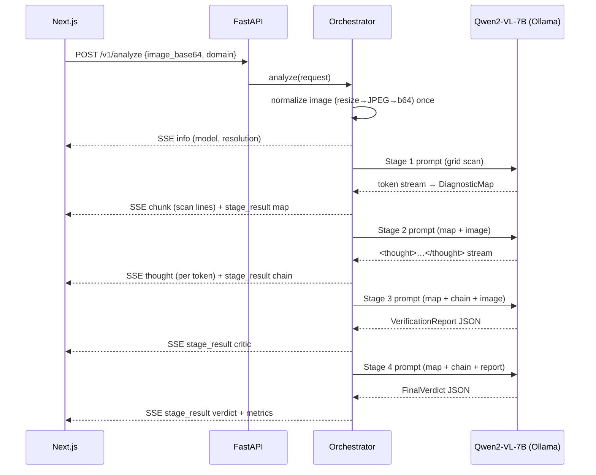

> Historical planning/reference document. For current behavior, setup and evidence, use the [README](../README.md) and [evaluation results](evaluation/reliability/RESULTS.md). Earlier targets and claims below are not validated product results.

# System Architecture

## Component diagram

```mermaid
flowchart TD
    U[User Browser] -->|upload + EventSource| F[Next.js 15 Dashboard]
    F -->|/api/v1/analyze| B[FastAPI]
    B --> O[PipelineOrchestrator]
    O --> P[ImageProcessor]
    O --> K[KVCacheManager]
    O --> S[SpeedTracker]
    O --> G[GPUMonitor]

    O --> A1[Stage 1 · SpatialMapper]
    O --> A2[Stage 2 · Deliberator]
    O --> A3[Stage 3 · Critic]
    O --> A4[Stage 4 · Synthesizer]

    A1 --> M[Ollama / Qwen2-VL-7B]
    A2 --> M
    A3 --> M
    A4 --> M

    A1 -->|DiagnosticMap JSON| O
    A2 -->|thought stream (SSE)| O
    A3 -->|VerificationReport JSON| O
    A4 -->|FinalVerdict JSON| O
```

## Data flow for one analysis



## Modules

| Module | Responsibility |
| --- | --- |
| `backend/pipeline/orchestrator.py` | Chains the 4 agents, owns SSE event framing, decides demo vs real backend |
| `backend/pipeline/image_processor.py` | Base64 decode, mime sniffing, RGB normalize, capped resize (1280px), JPEG re-encode |
| `backend/pipeline/kv_cache_manager.py` | `(model, image_hash, stage)` result cache; `PipelineContext` carried across stages |
| `backend/agents/base_agent.py` | Shared Ollama/vLLM streaming, JSON extraction, metrics hooks |
| `backend/ml_utils/ollama_client.py` | Async Ollama `/api/generate` streamer with image payloads |
| `backend/ml_utils/gpu_monitor.py` | pynvml VRAM/util/temp snapshot, CPU-only safe fallback |
| `backend/ml_utils/speed_tracker.py` | Millisecond per-stage latency + token throughput |
| `frontend/hooks/useSSEStream.ts` | Reads the POST body as a stream, parses SSE frames |
| `frontend/app/page.tsx` | Single dashboard binding all stage UI + gauges |

## SSE contract

```
event: chunk        {type, stage:"mapping", delta}
event: thought      {type, stage:"deliberation", chunk, reasoning_type}
event: stage_result {type, stage:"mapping|deliberation|critic|synthesis", data}
event: metrics      {type, stage:"metrics", data:{latency, stage_latencies, tokens/s, vram}}
event: error        {type, stage, message}
event: info         {type, stage:"system", data:{model, resolution, demo_mode}}
```